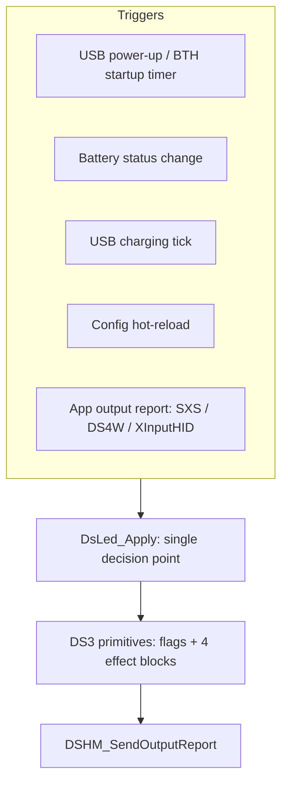

# Unify and fix LED handling in the driver

## Context

LED state is currently written from six unrelated places, each re-deciding whether it is allowed to and each carrying its own copy of the battery-to-LED mapping:

- [driver/Ds3.c](../../driver/Ds3.c) — the byte-level primitives (`DS3_SET_LED_FLAGS`, `DS3_SET_LED_DURATION`, `DS3_SET_LED_DURATION_DEFAULT`)
- [driver/Device.c](../../driver/Device.c) — initial buffer fill, plus the hot-reload callback
- [driver/DsBth.Timers.c](../../driver/DsBth.Timers.c) — wireless startup
- [driver/DsHidMiniDrv.c](../../driver/DsHidMiniDrv.c) — USB charging animation and Bluetooth battery-change handler
- [driver/HID.Reports.c](../../driver/HID.Reports.c) — SIXAXIS pass-through and DS4Windows emulation
- [driver/OutputReport.c](../../driver/OutputReport.c) — the custom-pattern override, re-applied on every single send



## Bugs found

1. **Three conflicting "default" LED effects.** The static tables `G_Ds3UsbHidOutputReport` / `G_Ds3BthHidOutputReport` use `FF 27 10 00 32`; `ConfigSetDefaults` uses `FF 00 01 00 01`; and `DS3_SET_LED_DURATION_DEFAULT` intends `0x2710` but passes it as a `USHORT` of `0x27`, so it actually emits `FF 00 27 00 32`. Issue 365 and [ControlApp/Models/DshmConfigManager/DshmTranslationUtils.cs](../../ControlApp/Models/DshmConfigManager/DshmTranslationUtils.cs) both say `FF 00 01 00 01` is the PS3-correct static effect.
2. **`DsLEDAuthorityApplication` is not honored** (issue 351). The guard `Authority == DsLEDAuthorityDriver || OutputReport.Mode == Ds3OutputReportModeDriverHandled` is copy-pasted three times in `DsHidMiniDrv.c`; because `OutputReport.Mode` starts as `DriverHandled`, the driver drives LEDs under `Application` authority until an app happens to write. `OutputReport.Mode` is also latched to `WriteReportPassThrough` forever — never reset on D0Entry or hot-reload.
3. **Custom pattern clobbers everything** (issue 350). `DSHM_SendOutputReport` re-applies `CustomPatterns` on every send regardless of authority, so rumble-only and DS4Windows sends overwrite whatever the app set.
4. **Hot-reload does not recompute LED state** (issue 349). `DsDevice_HotReloadEventCallback` calls `DSHM_SendOutputReport` but nothing recomputes flags from the new mode plus the known battery status, so the stale pattern is re-sent.
5. **`BatteryStatus` is never updated while charging on USB** (`DsHidMiniDrv.c` around line 819). The `Charging` branch never assigns `pDevCtx->BatteryStatus`, so `battery != pDevCtx->BatteryStatus` stays true and `WdfDeviceAssignProperty` runs on every input report for the whole charging session.
6. **Wireless startup ignores both mode and authority.** `DsBth_EvtStartupDelayTimerFunc` always uses the single-LED mapping, so bar-graph users get the wrong display until the first battery change, and it writes LEDs even under `Application` authority.
7. **Dead guard.** `if (DS3_GET_LED_FLAGS(pDevCtx) != 0x00)` in the Bluetooth battery handler can never be false, because `Device.c` seeds the Bluetooth buffer with `DS3_LED_OFF` (`0x20`).
8. **Unsynchronized buffer access.** All of the above mutate the shared `OutputReportMemory` from USB/Bluetooth completion routines, the hot-reload thread-pool callback and the HID write path, while `OutputReport.Lock` is only held inside `DSHM_SendOutputReport`.
9. **Minor.** `DsUsb_Ds3IndicatorsOff` is dead code; `ConfigSetDefaults` never initializes `LEDSettings.Authority`; `Device.c:678` uses the Bluetooth-specific `DS3_BTH_SET_LED` instead of the connection-agnostic setter; the four-LED effect magic numbers `(0xFF, 15, 127, 127)` and `(0xFF, 3, 127, 127)` are repeated across three files.

## Decisions already taken

- Scope is refactor **plus** the behavior fixes it exposes (issues 349, 350, 365), in one branch.
- `DsLEDAuthorityApplication` becomes strict: the driver never touches LEDs. Only `Automatic` keeps the current start-in-driver-mode handoff.

## Approach

### 1. New policy module: `driver/DsLed.h` + `driver/DsLed.c`

Add the file to [driver/dshidmini.vcxproj](../../driver/dshidmini.vcxproj) and its `.filters`, add `WPP_DEFINE_BIT(TRACE_LED)` to [driver/Trace.h](../../driver/Trace.h), and include `DsLed.h` from `Driver.h`. Public surface:

```c
// Named effect blocks, replacing the scattered magic numbers
#define DS3_LED_EFFECT_STATIC       { 0xFF, 0x0001, 0x00, 0x01 }  // issue 365
#define DS3_LED_EFFECT_SLOW_FLASH   { 0xFF, 0x000F, 0x7F, 0x7F }  // was (0xFF, 15, 127, 127)
#define DS3_LED_EFFECT_FAST_FLASH   { 0xFF, 0x0003, 0x7F, 0x7F }  // was (0xFF, 3, 127, 127)
#define DS3_LED_EFFECT_NONE         { 0x00, 0x0000, 0x00, 0x00 }

BOOLEAN DsLed_IsDriverInCharge(_In_ PDEVICE_CONTEXT Context);
VOID    DsLed_Apply(_In_ PDEVICE_CONTEXT Context);          // recompute + write, no send
NTSTATUS DsLed_Refresh(_In_ PDEVICE_CONTEXT Context, _In_ DS_OUTPUT_REPORT_SOURCE Source);
VOID    DsLed_AdvanceChargingAnimation(_In_ PDEVICE_CONTEXT Context);
VOID    DsLed_SetFlagsAndEffects(_In_ PDEVICE_CONTEXT Context, _In_ UCHAR Flags, _In_ const DS_LED* Effect);
```

`DsLed_IsDriverInCharge` becomes the *only* authority check:

- `DsLEDAuthorityDriver` — always true
- `DsLEDAuthorityApplication` — always false (behavior fix for bug 2)
- `DsLEDAuthorityAutomatic` — `OutputReport.Mode == Ds3OutputReportModeDriverHandled`

`DsLed_Apply` holds `Context->OutputReport.Lock` (fixing bug 8; `DSHM_SendOutputReport` gets an unlocked inner variant so it can be called from within), then:

- returns immediately unless `DsLed_IsDriverInCharge`
- for `DsLEDModeCustomPattern`, writes `CustomPatterns.LEDFlags` and the four configured blocks — this is where the override moves to, so it is applied on config load and hot-reload instead of on every send (fixes bug 3 / issue 350)
- for the two battery-indicator modes, applies the single battery-to-flags mapping (one table, replacing the three copies) using `Context->BatteryStatus`, `DS3_LED_EFFECT_SLOW_FLASH` for `Low`/`Dying` and `DS3_LED_EFFECT_STATIC` otherwise
- zeroes the effect block of every LED whose flag bit is clear, per the issue 351 discussion and matching what ControlApp already writes

### 2. Fix the primitives in [driver/Ds3.c](../../driver/Ds3.c) / [driver/Ds3.h](../../driver/Ds3.h)

- Change the static `G_Ds3UsbHidOutputReport` / `G_Ds3BthHidOutputReport` LED blocks from `FF 27 10 00 32` to `FF 00 01 00 01`, and seed both with `DS3_LED_OFF` consistently.
- Replace `DS3_SET_LED_DURATION_DEFAULT` (whose `0x27` is the truncated-`0x2710` bug) with `DsLed_SetFlagsAndEffects(..., DS3_LED_EFFECT_STATIC)`.
- Delete the unused `DsUsb_Ds3IndicatorsOff`.
- Rename the ALL-CAPS pseudo-macro functions to the driver's normal convention (`DsLed_SetFlags`, `DsLed_GetFlags`, `DsLed_SetEffect`, `Ds3_GetUnifiedOutputReportBuffer`, `Ds3_GetRawOutputReportBuffer`), keeping the genuinely-macro `DS3_USB_SET_LED` family as-is.

### 3. Rewire the call sites

- [driver/DsBth.Timers.c](../../driver/DsBth.Timers.c): replace the inline battery switch with `DsLed_Apply` (fixes bug 6).
- [driver/DsHidMiniDrv.c](../../driver/DsHidMiniDrv.c): both battery handlers call `DsLed_Refresh`; the charging animation calls `DsLed_AdvanceChargingAnimation`. Assign `pDevCtx->BatteryStatus = battery` unconditionally at the top of the USB handler and gate the property write on the change (fixes bug 5). Drop the dead `DS3_GET_LED_FLAGS() != 0x00` guard (bug 7).
- [driver/OutputReport.c](../../driver/OutputReport.c): delete the custom-pattern block entirely; `DSHM_SendOutputReport` becomes a pure "send current buffer".
- [driver/Device.c](../../driver/Device.c): use the connection-agnostic setter for the initial fill, and call `DsLed_Refresh(pDevCtx, Ds3OutputReportSourceDriverHighPriority)` from `DsDevice_HotReloadEventCallback` instead of the bare send (fixes bug 4 / issue 349).
- [driver/HID.Reports.c](../../driver/HID.Reports.c): replace both `Authority == / != DsLEDAuthorityDriver` checks with `!DsLed_IsDriverInCharge` / `DsLed_IsDriverInCharge`, and swap the repeated four-call `DS3_SET_LED_DURATION_DEFAULT` blocks for `DsLed_SetFlagsAndEffects`.
- [driver/Configuration.c](../../driver/Configuration.c): set `Config->LEDSettings.Authority = DsLEDAuthorityAutomatic` explicitly in `ConfigSetDefaults`, and align the custom-pattern defaults with `DS3_LED_EFFECT_STATIC`.
- [driver/Power.c](../../driver/Power.c): reset `OutputReport.Mode` to `Ds3OutputReportModeDriverHandled` in `DsHidMini_EvtDeviceD0Entry` so the Automatic handoff is per power cycle rather than permanent.

### 4. Verification

`msbuild dshidmini.sln` for x64 (Release) to confirm the driver still compiles; there is no test harness on the driver side, so the remaining validation is manual on hardware. Work happens on a new `fix/351-unify-led-handling` branch off `master`.
